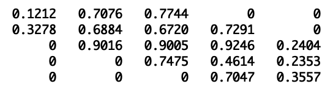
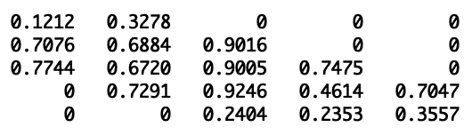
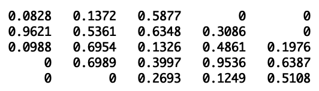

### 2. Definisikan fungsi di MATLAB/Octave yang mengimplementasikan algoritma faktorisasi **LU** untuk matriks pita berukuran **n x n** dengan lebar pita-atas **p** dan lebar pita-bawah **q**.

### Asumsikan pivot tidak pernah nol sehingga pivoting tidak diperlukan. Masukannya adalah matriks **A** juga bilangan asli **p** dan **q** yang menyatakan lebar pita atas dan bawah, berturut turut.
### Tuliskan komentar jumlah operasi penjumlahan, pengurangan, perkalian, pembagian dinyatakan dalam n, p, q.
<br>



```
function [L U] = lu_banded(A, p, q)

  [n, n] = size(A);

  L = eye(n);

  # diags
  for k=1:n-1                       # O(n-1)

    # loop lower band
    for i=k+1 : min(k+q, n)         # O(q)

      # get multiplier
      L(i, k) = A(i, k) / A(k, k);

      # loop upper band
      for j=k : min(k+p, n)         # O(p)
        A(i, j) = A(i, j) - A(k, j) * L(i, k);

      endfor
    endfor
  endfor
  U = A

endfunction

```

k:1..4
  i:k+1:k+q
    j:k:k+p

operasi penjumlahan pengurangan = `` <br>
operasi perkalian               =
```
= (n - max(p, q)) * p * q+
int k = n - max(p, q) + 1;
for(int k = n - max(p, q) + 1; k < n; k++) {
    ans += min(n-k, q) * (min(n-k, q) + 1);
}
```
<br>
operasi pembagian = `q * (n - q) + q * (q - 1) / 2` <br>



